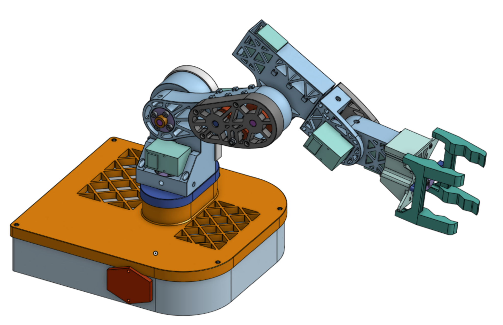

# 5 Axis Desktop Robot Arm
I am going to build a compact desktop 5 Axis robotic arm from with 400 mm reach and a weight of around 900g, with swappable end effectors to increase functionality.

My end goal is for the arm to be able to autonomously respond to commands using a small local AI and a router. For this, it will need to be able to take voice commands using a microphone, use a camera to navigate the environment and complete the task, talk to me in case it needs to clarify something, and run YOLO, speech to text and text to speech, and maybe a small LLM, all locally. This is why I selected the Nvidia Jetson Orin Nano Super for this project. While it is definitely overkill for V1, it will be useful in the future.

## Goals
- I want this arm to be able to perform precision movement within 1 mm accuracy. Since gears can have backlash, I chose to use belts, since a properly tensioned belt should have minimal backlash.
- I want the arm to be able to lift at least 400 g. I am not sure if v1 can achieve this because it is a little heavy, so I will have to test it once I build it.

## Design

**Gears vs Belts:** Since gears can have backlash, I chose to use belts, since a properly tensioned belt should have minimal backlash. However, belts need to be larger to avoid putting too much strain on the belt, so they are bulkier and heavier which will affect my weight capacity.

**Torque:** I used a robot arm torque calculator to decide what ratios to use. According to the calculator, the realistic capacity for the arm at full reach is about 350g including losses from inefficiency. While this doesn't meet my goal, it is good for a first version and with belt tuning the efficiency could increase. I selected the STS3215 servos because they are affordable and adequate for most joints and commonly used for arms like the SO101, while the higher torque STS3520 are used on joints which see a lot of load (the 2nd and 3rd ones). Servos are great because they have built in potentiometers which reduces the amount of components need for getting precise motion.

**Mass:** I tried to optimize the weight of 3d printed parts to make the arm as light as possible. However, motors and metal parts like shafts and screws make up over 75% of the actual weight so after a point it wasn't worth it to optimize the plastic parts in exchange for strength. The center of mass is around 170 mm from the L-axis pivot point (the second motor).

**Material:** I selected PETG because it can be used in most 3d printers, is similar in price to PLA, and it much less brittle than PLA. My test prints verified that it is a strong material, as it was pretty challenging to bend and it barely budged.

**Safety:** I will be using a switch and keeping all of the electronics inside of the base box to reduce risk of touching any live wires or terminals. I will also be using electrical tape to seal connections, and I have a fuse to prevent the servos from drawing too much current and potentially burning out. Here is my wiring diagram:

